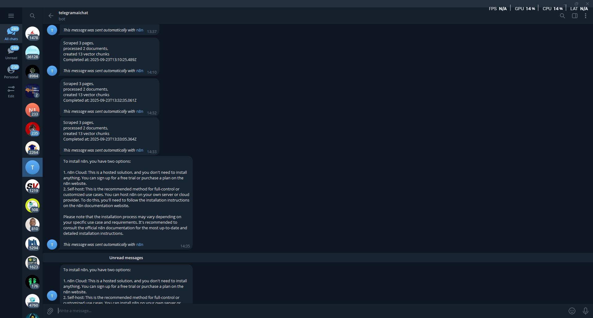

# Enhanced Web Scraping & RAG Workflow  
> **Built with n8n + Supabase + Mistral + Firecrawl**

This workflow automates **web scraping, markdown processing, smart chunking, vector storage, and RAG-powered semantic search**.  
It uses **n8n** as the automation engine, **Firecrawl** for crawling, **Mistral** for embeddings, and **Supabase** for vector storage and semantic retrieval.

---

## 📦 Features

### Workflow Capabilities
- Scrape entire websites with structured markdown
- Filter & clean content before embedding
- Smart chunking with overlap
- Embedding via Mistral Cloud
- Store in Supabase with rich metadata
- Chatbot-ready semantic search
- Telegram summaries for each run

---

## 🧱 Metadata Fields
Each chunk is stored with the following metadata for full traceability:
- `source_url`
- `title`
- `chunk_index`
- `total_chunks`
- `word_count`
- `processed_at`

---

## 🔁 Workflow Steps

1. **Trigger** — Webhook or manual
2. **Crawler** — Firecrawl API
3. **Status Check** — Wait node until crawl completes
4. **Processing** — Filter and clean scraped content
5. **Chunking** — Paragraph-aware semantic splitting
6. **Embeddings** — Mistral Cloud API
7. **Storage** — Supabase `rag_markdown_enhanced` table
8. **Alerts** — Telegram notification with summary
9. **Chatbot** — Semantic retrieval via `semantic_search_enhanced`

---

## 🛠️ Supabase Schema

```sql
create extension if not exists vector;

create table rag_markdown_enhanced (
  id bigserial primary key,
  page_content text not null,
  source_url text not null,
  title text,
  chunk_index int,
  total_chunks int,
  word_count int,
  processed_at timestamptz,
  embedding vector(1024)
);

create or replace function semantic_search_enhanced(
  query_embedding vector(1024),
  match_count int default 5,
  filter jsonb default '{}'
) returns table (
  id bigint,
  page_content text,
  source_url text,
  title text,
  chunk_index int,
  total_chunks int,
  word_count int,
  processed_at timestamptz,
  similarity float
) language plpgsql as $$
begin
  return query
  select
    id,
    page_content,
    source_url,
    title,
    chunk_index,
    total_chunks,
    word_count,
    processed_at,
    1 - (embedding <=> query_embedding) as similarity
  from rag_markdown_enhanced
  order by embedding <=> query_embedding
  limit match_count;
end;
$$;
```

---

## 🔐 Environment Variables

```bash
N8N_PORT=5678
SUPABASE_URL=your-supabase-url
SUPABASE_KEY=your-supabase-service-role-key
MISTRAL_API_KEY=your-mistral-api-key
OPENROUTER_API_KEY=your-openrouter-key
TELEGRAM_API_KEY=your-telegram-bot-token
```

---

## 🖼️ Sample Output

```
Scraped 5 pages
Processed 4 documents
Created 27 vector chunks
Completed at: 2025-09-23T12:35:41Z
```

---

## 🧾 Screenshots

Below are example screenshots of the workflow in action:

| Description                          | Screenshot |
|--------------------------------------|------------|
| 🔠Full Workflow Overview            |  |
| 🧠 Embedding & Supabase Vector Store |  |
| 📢 Telegram Summary Notification and chat response     |  |
---

## 👨‍💻 Credits

Micah Jatau – Automation Specialist & Builder  
🔗 [micahjatau.github.io](https://micahjatau.github.io) | [n8n.io](https://n8n.io)

---

**Note:**  
This workflow is available as an importable JSON in the `Advanced webscraper.json` file. To test or fork this pipeline, load the workflow into your n8n instance and update the credentials accordingly.
