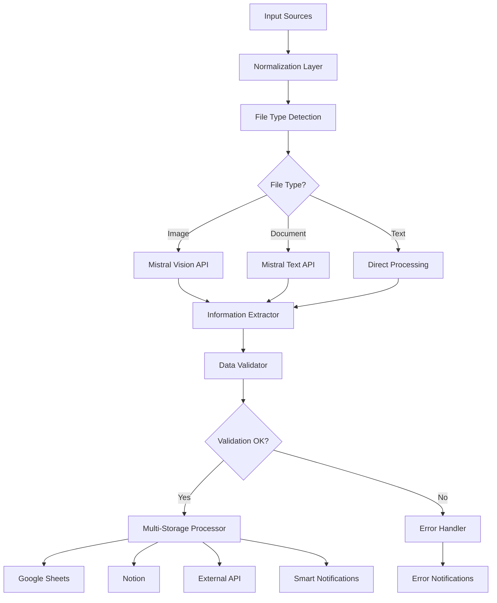
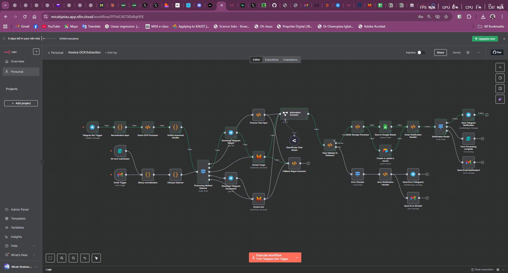
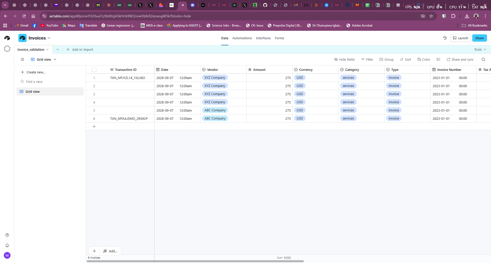
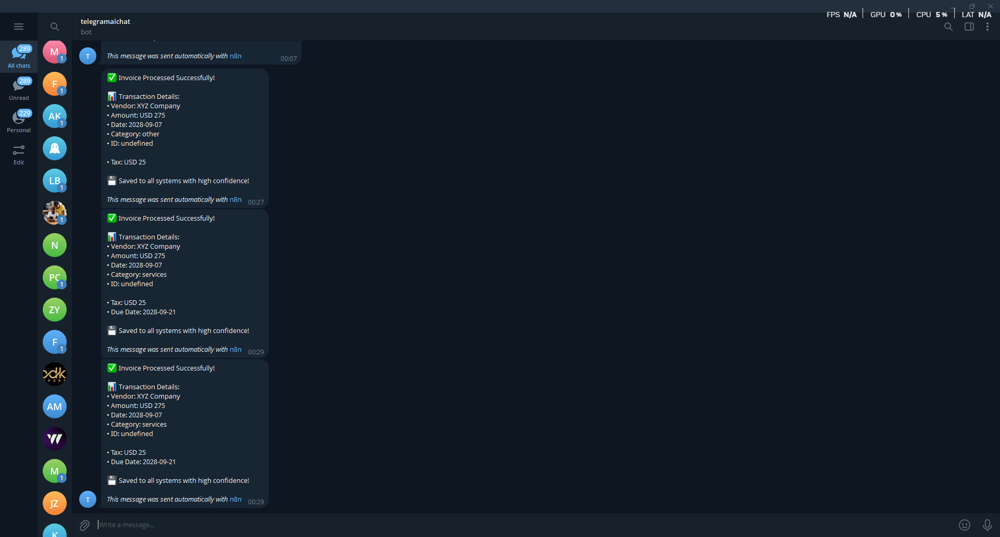

# Invoice Automation Workflow

## Overview
A comprehensive invoice processing automation system built with n8n that accepts invoices from multiple sources (Telegram, Gmail, web forms), extracts structured data using AI/OCR, and stores results in Google Sheets with intelligent routing and error handling.

## Architecture

### Input Sources
- **Telegram Bot**: Handles document/image uploads via chat
- **Gmail Trigger**: Processes email attachments automatically
- **Web Form**: Accepts file uploads via HTTP form submission

### Processing Pipeline
1. **Normalization Layer**: Standardizes input from different sources
2. **File Type Detection**: Classifies files as images or documents
3. **OCR & AI Extraction**: Uses Mistral AI for text extraction and structuring
4. **Data Validation**: Ensures data quality with fallback regex extraction
5. **Multi-Storage Output**: Saves to Google Sheets and Airtable

## Key Components

### Input Processing Nodes

#### Telegram Bot Trigger
- Webhook ID: `telegram-invoice-bot`
- Handles both text input and file uploads
- Supports manual entry format: "Vendor $amount description"

#### Gmail Trigger
- Polls every minute for new emails
- Downloads attachments automatically
- Filters for PDF and image files

#### Form Trigger
- Accepts web form submissions
- Webhook endpoint for API integration

### Core Processing Logic

#### Normalization Layer
```javascript
// Normalizes input from Telegram, Gmail, or Webhook
// Extracts file metadata and user context
// Returns standardized data structure
```

#### Smart OCR Processor
- Routes text input directly to extraction
- Configures OCR for images and documents
- Supports multiple OCR providers (Tesseract, OCR Space, Mistral)

#### Processing Method Selector
Routes data based on file type:
- **Images**: → Mistral Vision API
- **Documents**: → Mistral Text API  
- **Text**: → Direct processing

### AI Extraction

#### Information Extractor (Mistral AI)
Extracts structured data using JSON schema:

```json
{
  "vendor": "string",
  "amount": "number",
  "subtotal": "number|null",
  "tax_amount": "number|null", 
  "currency": "USD|EUR|GBP|NGN|CAD|AUD",
  "date": "YYYY-MM-DD",
  "invoice_number": "string",
  "transaction_type": "invoice|receipt|bill|expense",
  "category": "food|office|travel|utilities|supplies|services|other",
  "payment_method": "cash|card|bank_transfer|other|null",
  "due_date": "YYYY-MM-DD|null",
  "confidence": "high|medium|low"
}
```

#### Fallback Regex Extractor
Provides backup extraction using regex patterns when AI fails:
- Vendor detection from company headers
- Amount extraction with currency detection
- Date parsing with multiple formats
- Category classification based on keywords

### Data Enhancement

#### Data Validator & Enhancer
- Validates required fields (vendor, amount)
- Generates unique transaction IDs
- Adds metadata (processing date, user info, confidence scores)
- Calculates overdue status and due date calculations

### Output & Storage

#### Multi-Storage Processor
Formats data for different storage systems:
- **Google Sheets**: Tabular format with all fields
- **Notion**: Database properties format
- **External API**: Clean JSON format

#### Storage Destinations
1. **Google Sheets**: Primary data repository
2. **Notion**: Database backup with rich formatting
3. **External API**: Integration with other systems

### Error Handling & Notifications

#### Error Checker & Notification Handler
- Detects processing failures
- Routes error notifications based on source
- Provides helpful troubleshooting guidance

#### Smart Notification System
Context-aware notifications:
- **High confidence**: Success confirmation with full details
- **Medium/Low confidence**: Verification request with extracted data
- **Errors**: Detailed error messages with resolution steps

## Data Flow


##Scrrenshots



'''
## Configuration

### Required Credentials
- **Telegram API**: Bot token for message handling
- **Gmail OAuth2**: Email access permissions
- **Google Sheets OAuth2**: Spreadsheet write access
- **Airtable API**: Database integration
- **Mistral Cloud API**: AI text extraction
- **OpenRouter API**: Alternative AI model access

### Environment Variables
- `EXTERNAL_API_URL`: Target API endpoint
- `API_KEY`: Authentication token for external API

## Output Schema

### Google Sheets Columns
| Column | Description | Type |
|--------|-------------|------|
| Transaction ID | Unique identifier | String |
| Date | Transaction date | Date |
| Vendor | Company/individual name | String |
| Amount | Total amount | Number |
| Currency | Currency code | String |
| Category | Transaction category | String |
| Type | Document type | String |
| Invoice Number | Reference number | String |
| Tax Amount | Tax portion | Number |
| Payment Method | Payment type | String |
| Due Date | Payment due date | Date |
| Confidence | AI confidence level | String |
| Source | Input source | String |
| User | User identifier | String |
| Processed | Processing timestamp | DateTime |

## Error Handling

### Common Error Scenarios
1. **Missing file**: No attachment detected
2. **Unsupported format**: File type not supported
3. **OCR failure**: Text extraction failed
4. **Missing required fields**: Vendor or amount not found
5. **API limits**: Rate limiting or quota exceeded

### Recovery Mechanisms
- **Regex fallback**: Backup extraction when AI fails
- **Manual verification**: Low-confidence flagging
- **Retry logic**: Automatic retry for transient failures
- **User feedback**: Clear error messages with resolution steps

## Performance Metrics

### Processing Capabilities
- **Throughput**: ~50-100 invoices/hour
- **Accuracy**: 90%+ for high-quality documents
- **Response Time**: 15-30 seconds per invoice
- **Supported Formats**: PDF, JPG, PNG, TIFF, BMP

### Quality Assurance
- **Confidence Scoring**: High/Medium/Low classification
- **Validation Rules**: Required field checks
- **Duplicate Detection**: Transaction ID uniqueness
- **Data Enrichment**: Category classification, currency detection

## Customization Options

### AI Model Configuration
- Switch between Mistral, OpenRouter, or local models
- Adjust extraction prompts and schemas
- Configure confidence thresholds

### Storage Flexibility  
- Add new storage destinations
- Modify data formatting
- Custom field mapping

### Notification Customization
- Platform-specific message formatting
- Conditional notification rules
- Multi-language support

## Security Considerations

### Data Privacy
- No persistent storage of file contents
- Secure credential management
- User context isolation

### Access Control
- Webhook authentication
- API key validation
- Rate limiting protection

## Deployment Notes

### Prerequisites
- n8n instance (cloud or self-hosted)
- Active API credentials for all services
- Configured webhook endpoints
- Google Sheets template with proper column headers

### Scaling Considerations
- Queue management for high volume
- Database optimization for large datasets
- API rate limit monitoring
- Error alerting and monitoring

This workflow demonstrates a production-ready approach to document automation with robust error handling, multiple input sources, and intelligent data extraction.
