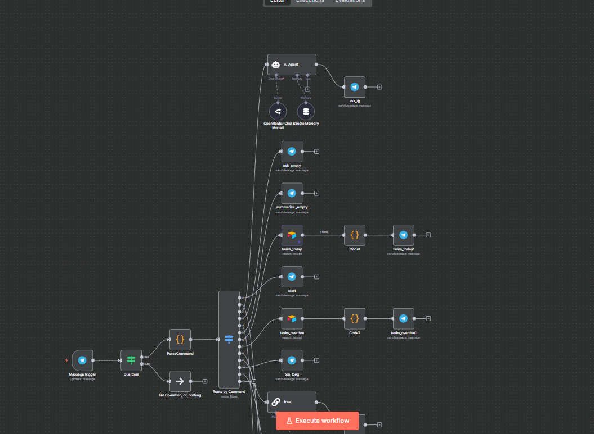
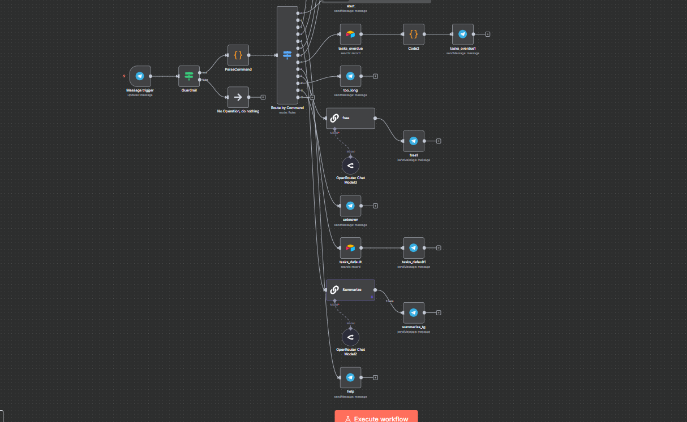
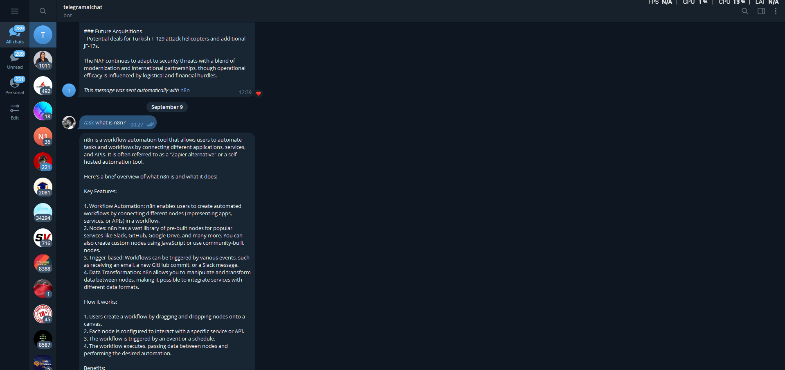

# Telegram AI Bot with n8n + OpenAI

## Overview
A Telegram chatbot that integrates with OpenAI through n8n.  
Users can message the bot in Telegram, and it replies with GPT-powered responses in real time.

---

## Problem Solved
Many people want to interact with AI directly inside Telegram without writing code or setting up servers.  
This bot demonstrates how to achieve that with a **no-code workflow** using n8n.

---

## Tools Used
- [n8n](https://n8n.io) – workflow automation
- Telegram Bot API
- OpenAI API (GPT-4 / GPT-3.5)

---

## Workflow Summary
1. User sends a message to the Telegram bot
2. n8n receives the webhook and extracts the text
3. n8n sends the text to OpenAI API
4. AI response is returned to Telegram
5. Error handling sends notifications if something fails

---

## Setup Instructions
1. Export this repo / clone it
2. Import `workflow.json` into n8n
3. Add credentials:
   - **Telegram API**: Create a bot with [@BotFather](https://t.me/botfather)
   - **OpenAI API**: Get an API key from [platform.openai.com](https://platform.openai.com)
4. Update the credentials in the workflow
5. Activate the workflow and start chatting with your bot!

---

## Screenshots
  
  

---

## Future Improvements
- Add memory so the bot remembers past conversations
- Support voice-to-text with Whisper API
- Deploy to production (n8n cloud or self-hosted)

---

## License
MIT License
