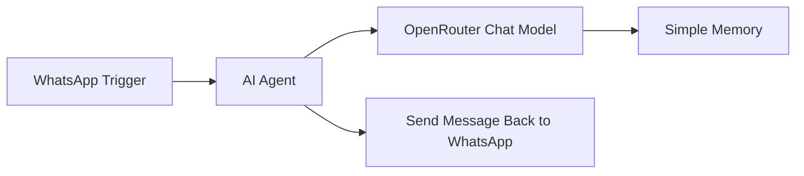

# 🤖 WhatsApp Chatbot with n8n + OpenRouter AI

## 📌 Overview

This project demonstrates how to build a **WhatsApp AI chatbot** using [n8n](https://n8n.io), **OpenRouter LLMs**, and a simple memory buffer for context retention.
It enables real-time AI-powered conversations directly inside WhatsApp.

---

## 🚀 Features

* ✅ **WhatsApp Trigger** – Captures incoming WhatsApp messages via webhook
* ✅ **AI Agent** – Routes the input to an OpenRouter LLM for intelligent replies
* ✅ **Context Memory** – Stores recent messages for contextual awareness
* ✅ **Response Delivery** – Sends AI-generated replies back to WhatsApp users

---

## 🛠️ Tech Stack

* [n8n](https://n8n.io) – Workflow automation platform
* [WhatsApp Business Cloud API](https://developers.facebook.com/docs/whatsapp) – Message trigger & reply
* [OpenRouter](https://openrouter.ai) – Access to large language models (DeepSeek R1 in this case)
* Memory Buffer Node – Maintains conversation flow

---

## 📂 Workflow Summary



---

## ⚙️ Setup Instructions

### 1. Clone the Repository

```bash
git clone https://github.com/yourusername/whatsapp-chatbot.git
cd whatsapp-chatbot
```

### 2. Import Workflow into n8n

* Open your n8n instance
* Import the provided `Whatsapp Chatbot.json` file

### 3. Configure Credentials

* **WhatsApp API** → Add your `phone_number_id`, `recipient_phone_number`, and access token
* **OpenRouter API** → Add your API key for the chosen LLM

### 4. Run the Workflow

* Activate the workflow in n8n
* Send a WhatsApp message to your connected number
* Get an AI-powered response 🎉

---

## 📸 Example Use Case

* A user sends: *“What’s the capital of Finland?”*
* Chatbot replies: *“The capital of Finland is Helsinki 🇫🇮.”*

---

## 📌 Next Steps

* Add multi-user session handling
* Expand with different models from OpenRouter
* Connect to external APIs for real-time data (e.g., weather, finance, medical info)

---

## 👨‍💻 Author

**Micah Jatau**

* [GitHub Portfolio](https://github.com/micahjatau)
* [LinkedIn](https://linkedin.com/in/micahjatau)
* Exploring AI, automation, and digital health 🚀
